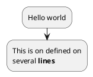

# Plantuml-vim

Replace plantuml text code with plantuml server image link or in return.

E.g

````markdown



````

Replace to 

````markdown

<div hidden>


<div>


````

## Installation Guide

### Requirements

- vim with python3
- plantuml

### Plugin Installation

* Use Vim Plug (and other manager)

```vim
Plug 'guxingke/plantuml-vim'
```

### Hotkey

```vim
<leander>gg
```

## Demo


